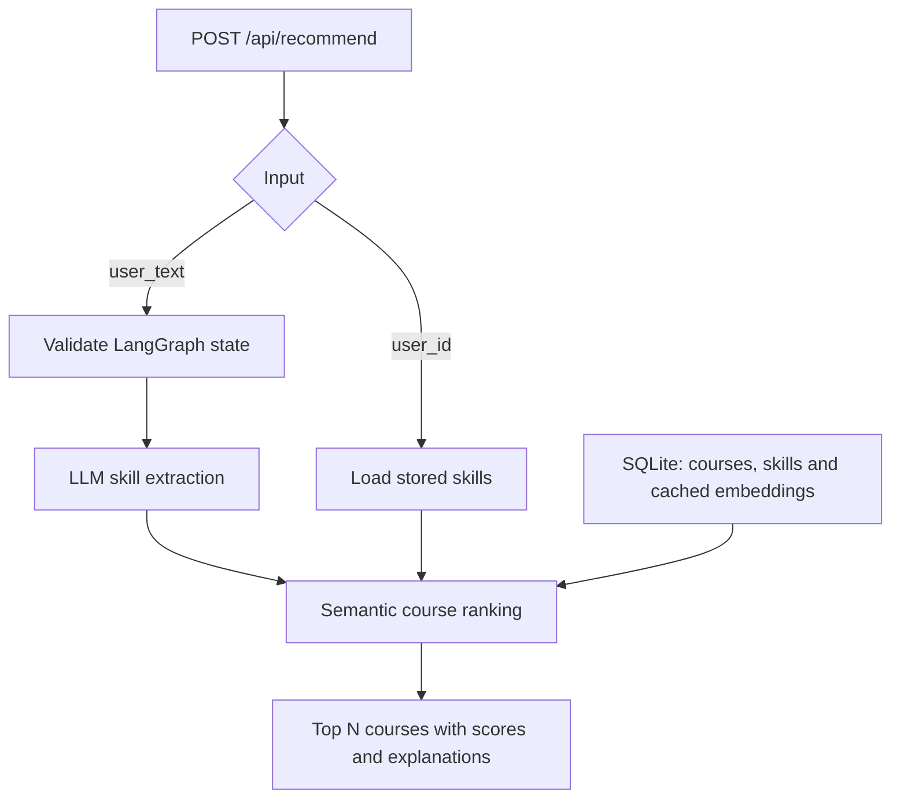

# Semantic Course Recommender

An AI engineering project that turns a learning request into ranked courses using **LLM skill extraction, sentence embeddings and cosine similarity**. A Flask API connects the recommendation engine to SQLite persistence and a structured LangGraph workflow.

**Stack:** Python · OpenAI · Sentence Transformers · scikit-learn · LangChain tools · LangGraph · Flask · SQLAlchemy Core · SQLite

## How it works

The API supports two entry points:

- **Stored user:** retrieve the user's skills, build a profile vector and rank courses.
- **Free text:** validate the request, extract skills with GPT-4o-mini, then rank the course catalog.



Skill embeddings are averaged into a profile vector. Course embeddings are compared against that vector using cosine similarity. Recommendations include a course ID, title, category, similarity score and explanation.

The LangGraph workflow has **three nodes**: input validation, skill extraction and course recommendation. The extraction and recommendation functions are wrapped as LangChain tools. Invalid workflow input terminates before extraction.

## Engineering details

- SQLAlchemy **Core** provides database access.
- Course and skill embeddings are cached in SQLite.
- The API enforces a JSON object, mutually exclusive inputs and an integer `top_n` from 1 to 10.
- Stored-user recommendations are logged with ranks, scores and explanations.
- The graph can also log results when called with a user ID; anonymous free-text API requests are not logged.
- The API returns 400 for invalid input and 404 for an unknown stored user.

This is a training project. Similarity scores indicate semantic closeness rather than calibrated recommendation confidence. There is no recommendation-quality benchmark or authentication layer included.

## Setup

Use Python 3.10+ and run commands from the repository root. The first embedding-model download requires internet access. OpenAI credentials are required by the skill-extraction module imported at API startup.

PowerShell:

```powershell
python -m venv .venv
.\.venv\Scripts\python.exe -m pip install -r requirements.txt
```

Create a local `.env`:

```dotenv
OPENAI_API_KEY=your_key_here
```

Initialize the schema and sample catalog:

```powershell
.\.venv\Scripts\python.exe -m day2.database
.\.venv\Scripts\python.exe -m day2.seed_data
```

The seed script adds sample courses, skills, users and user-skill relationships. It checks for existing records before inserting duplicates.

Start the development API:

```powershell
.\.venv\Scripts\python.exe -m day2.api
```

The API listens at `http://127.0.0.1:5000`. Free-text requests are sent to OpenAI for skill extraction; course ranking runs locally.

## API examples

Send either of these JSON bodies to `POST /api/recommend`:

**Stored profile**

```json
{"user_id": 1, "top_n": 3}
```

**Learning request**

```json
{"user_text": "I want to learn AI and backend development", "top_n": 3}
```

PowerShell example:

```powershell
$body = '{"user_text":"I want to learn AI and backend development","top_n":3}'
Invoke-RestMethod -Method Post -Uri "http://127.0.0.1:5000/api/recommend" -ContentType "application/json" -Body $body
```

The response contains `skills`, `recommendations` and an optional `message`. Rankings depend on extracted skills and the available catalog; example scores are not fixed expected results.

## Repository map

| Path | Responsibility |
| --- | --- |
| `day1/` | Course catalog, LLM extraction, embeddings and initial ranking |
| `day2/database.py` | Schema and database access |
| `day2/seed_data.py` | Repeatable sample-data initialization |
| `day2/recommendation_pipeline.py` | Stored-user and skill-based recommendations |
| `day2/api.py` | Flask request validation and API routing |
| `day3/agents.py` | LangChain tool wrappers |
| `day3/workflow.py` | Stateful graph, conditional validation and logging |

The day folders preserve the progression from a core recommendation engine to database integration and workflow orchestration.

## Development direction

Planned improvements include a recommendation evaluation dataset, weak-match thresholds, user feedback, automated API tests and a frontend. These are extensions rather than capabilities of the current repository.

## License

[MIT](LICENSE).
